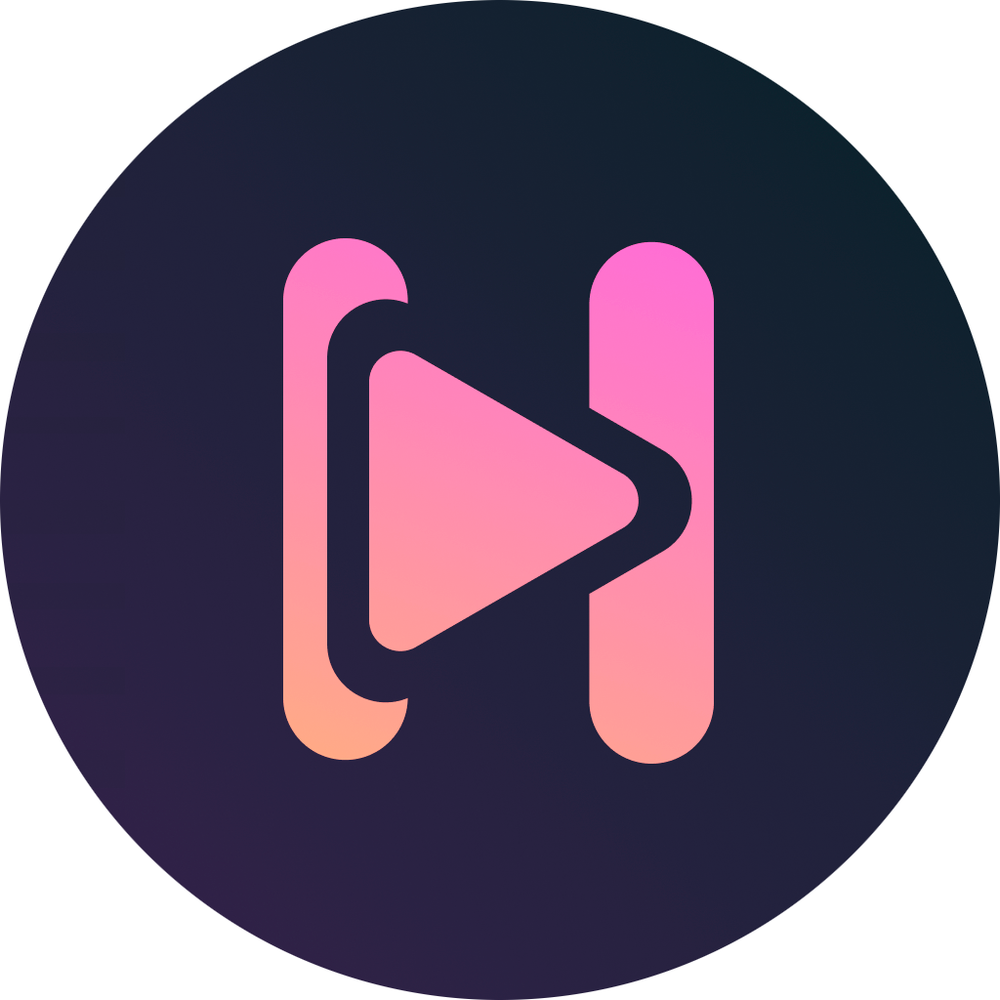

  

## Hyperion

A modern alternate YouTube front-end for Android

   

  

## Features

- Material You support
- Return YouTube Dislikes
- Ad removal
- More to come:
    - Google account login
    - SponsorBlock
    - Custom themes

## Installation

Install by downloading actions artifact and extracting, then installing the `app-debug.apk`. GitHub
releases will be added once Hyperion is in a more stable state.

## Acknowledgements

- [Return YouTube Dislikes](https://github.com/Anarios/return-youtube-dislike)

## License

Hyperion is licensed under the GNU General Public License

