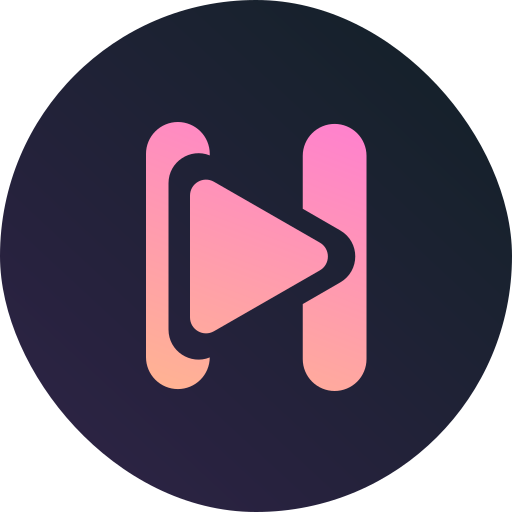

  
  
  ## Hyperion
  A modern alternate YouTube front-end for Android
  
  
  
  
  
  ----

## Project Status
Due to personal life, college & work I am not able to focus on Hyperion as hoped. 
It is not abandoned, only development will take longer than usual. 
Contributions are always welcome and encouraged.

## Features
- :art: Dynamic color
- :no_entry_sign: Ad-free
- :x: SponsorBlock
- :thumbsdown: Return YouTube Dislikes
- :arrow_down: Download videos
- :vhs: Picture in Picture
- :black_medium_square::white_medium_square: Dark/Light theme with/without following system color mode
- 文A Multi language
- More to come:
    - :bust_in_silhouette: Google account login
    - :art: Custom themes

## Installation
Bugs are to be expected at this state of development.  
The minimum supported Android version is Android 5.0 (API level 21).  
The latest APK can be downloaded
from [here](https://nightly.link/zt64/Hyperion/workflows/build-debug/main/app-debug.zip).  
GitHub releases will be added once Hyperion is in a more stable state.

## Translation
Please contribute to translations on [Crowdin](https://crowdin.com/project/hyperion-app).

## Acknowledgements
- [SponsorBlock](https://sponsor.ajay.app/)
- [Return YouTube Dislikes](https://github.com/Anarios/return-youtube-dislike)

## License
Hyperion is licensed under the GNU General Public License

