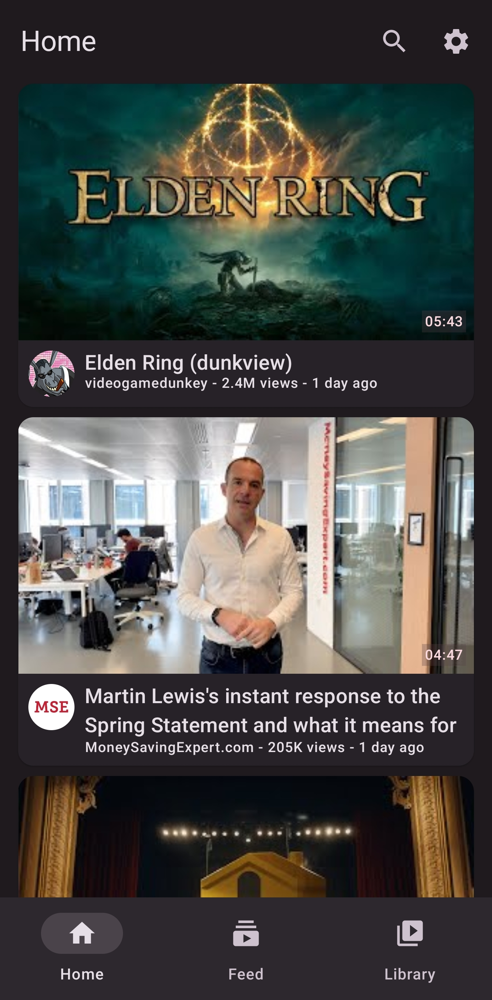
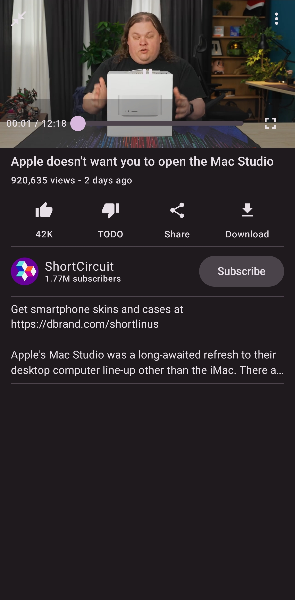
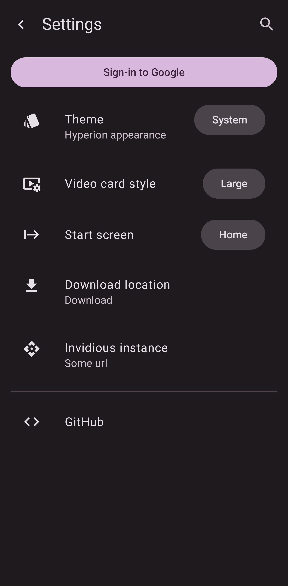

# Hyperion

A modern front-end for YouTube built using Kotlin compose, with Material You theming and many more features.

**NOTE**: Hyperion is not anywhere near stable release. Features may be broken or out-right missing.

## Socials
- Discord: https://discord.gg/nsvwH5xDQM

## Screenshots

  
## License
Hyperion is licensed under the GNU General Public License

